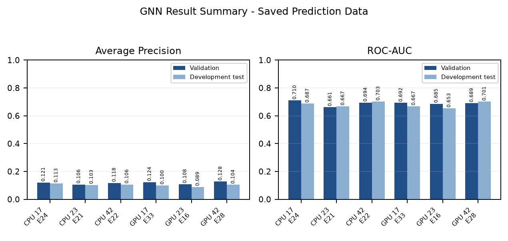
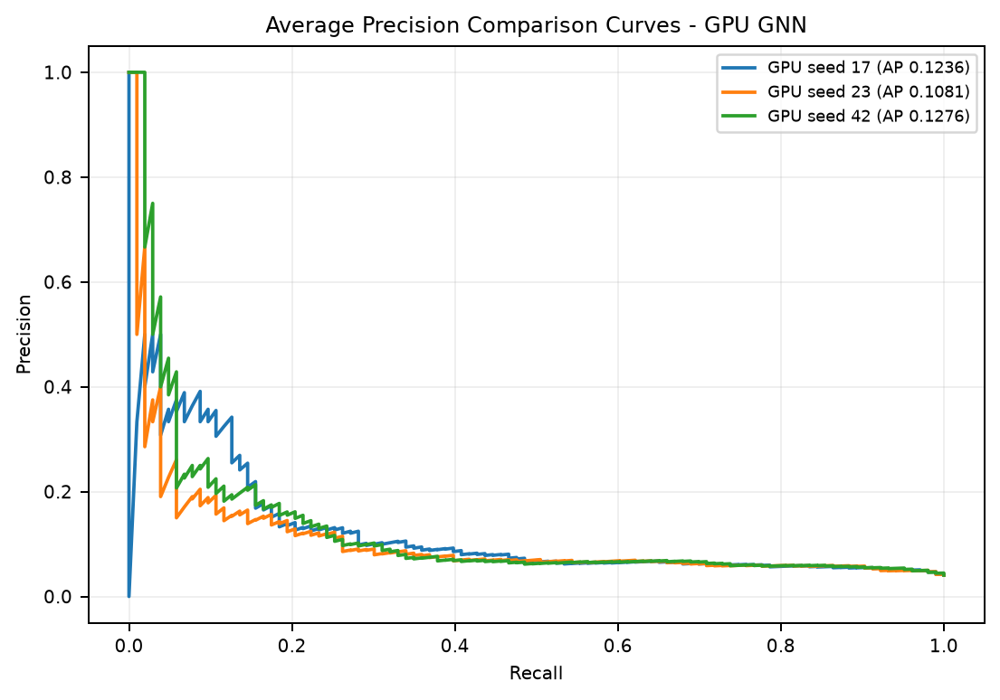

<div align="center">

# APEX-R

### Race Strategy Studio for TrackShift Hackathon 2025

**Team Devsez · VIPS-TC (GGSIPU)**

[](#run-the-demo)
[](#model-artefacts)
[](#what-apex-r-does)
[](#important-boundaries)

*Historical telemetry reference · Experimental graph signals · Constrained energy simulation*

</div>

> APEX-R is a research and hackathon demonstration system—not a live team pit wall. Public historical data does not provide private ERS state-of-charge, battery health or temperature, fuel load, team deployment maps, or confidential radio instructions.

<p align="center">
  
</p>

## What APEX-R does

APEX-R is an offline-first Formula 1 decision-support studio. It brings together three clearly separated layers:

| Layer | What it does | What it does **not** claim |
| --- | --- | --- |
| **Historical replay** | Displays timestamped telemetry and classified race-state context from approved local material. | A live F1 data feed or private team telemetry. |
| **Model advisory** | Produces experimental graph-model signals from supported input contracts. | A verified on-track overtake probability or proof that ATTACK will work. |
| **Strategy simulator** | Compares ATTACK, HOLD, HARVEST, and DEFEND under explicit energy and opponent assumptions. | Observed race outcomes caused by APEX-R. |

The dashboard keeps observed telemetry, model output, and simulated future branches visibly separate.

## Run the demo

### Standard local application

The standard judge demo runs locally. Python 3.10+ is required; no Docker, API key, or internet connection is needed after setup.

```bash
cd "/run/media/anshumandutta/ADATA HD710M PRO/APEX-R_Devsez_Full_Application"
python3 run.py --standalone --port 8001
```

Open [http://127.0.0.1:8001/](http://127.0.0.1:8001/). Stop the server with `Ctrl+C`.

If port `8001` is occupied, start it on another port, for example:

```bash
python3 run.py --standalone --port 8002
```

For a lightweight browser-only preview, open `dist/index.html`. The local server is recommended because it enables API checks, replay services, model status, and local decision logging.

### Run with the frozen GNN proxy on CUDA or CPU

Use the existing environment when it is available. `APEX_GNN_DEVICE=auto` selects CUDA when supported and otherwise falls back to CPU.

```bash
cd "/run/media/anshumandutta/ADATA HD710M PRO/APEX-R_Devsez_Full_Application"
source .venv_gnn_gpu/bin/activate
APEX_GNN_DEVICE=auto python run.py --standalone --port 8001
```

Confirm that the API and frozen model are available:

```bash
curl -sS http://127.0.0.1:8001/api/model/status
echo
```

Run one approved, label-free graph request:

```bash
python scripts/build_gnn_predict_example.py
curl -sS -X POST http://127.0.0.1:8001/api/model/predict \
  -H 'Content-Type: application/json' \
  --data-binary @examples/gnn_predict_request.json
echo
```

Expected fields include `model_version`, `selected_seed`, `selected_epoch`, `device`, and a finite `proxy_score`. Stale or incomplete required inputs are rejected rather than silently filled with invented telemetry.

## A 90-second judge flow

1. Start the local application and open **Pit wall**.
2. Select **Judge demo** or an approved historical reference window.
3. Point out the observed car state, selected driver pair, timestamp, and data freshness.
4. Show the advisory model status and its experimental proxy score.
5. Open **Strategy lab** and compare ATTACK, HOLD, HARVEST, and DEFEND from the same starting state.
6. Use a judge-selected action to create a separate simulated branch.
7. Open **Decision log** to inspect the inputs, action scores, constraints, and branch assumptions.

The recommended action comes from the strategy/energy layer under the stated simulation assumptions. Model output is shown as decision support, not a guarantee.

## Model artefacts

### Final presentation model: Hybrid GNN + GRU + Physics

The final APEX-R presentation uses the frozen hybrid package in [`deployment_packages/hybrid_gnn_epoch51/`](deployment_packages/hybrid_gnn_epoch51/). It contains the deployment checkpoint, exact checkpoint archive, model configuration, calibration, normalizer, feature contract, output schema, and package manifest.

The hybrid package was frozen at **epoch 51**. It uses graph-based race context, a temporal GRU component, and physics-derived tyre, pit-stop, and safety-constraint views. Its action layer combines model outputs with physics-feasible strategy scoring; it does **not** contain a separately trained four-class action classifier.

### Reproducible graph advisory: GNN Proxy v1

The API-level advisory artifact is [`models/frozen/gnn_proxy_v1/`](models/frozen/gnn_proxy_v1/):

| Item | Frozen value |
| --- | --- |
| Model version | `gnn_proxy_v1` |
| Selected run | GPU GNN, seed 42 |
| Checkpoint selection | Best validation checkpoint, epoch 28 |
| Task | Fixed-pair next-lap-boundary classified-order position-swap proxy |
| Output label | `experimental boundary position-swap proxy signal` |
| Use in demo | Advisory signal only; the rule/energy simulator makes the final action |

The proxy signal is not a calibrated overtake probability, not an ATTACK-benefit probability, and not a measure of actual battery state.

## Model development history

These models were trained on different feature sets, target definitions, and evaluation splits. Their metrics are not one shared leaderboard.

| Model | Main configuration | Reported result / role |
| --- | --- | --- |
| Legacy Logistic Regression | Eight baseline features; `StandardScaler`; `C=1.0`; `lbfgs` | ROC-AUC 0.711676; AP 0.122823; linear baseline |
| Legacy XGBoost | 300 trees; depth 4; learning rate 0.04 | ROC-AUC 0.787855; AP 0.193889 |
| Cleaned Feature XGBoost | Clean labels; saved 75-tree model | Locked holdout ROC-AUC 0.930631; AP 0.247008 |
| Enriched XGBoost | Rolling speed, throttle, brake, RPM, gear, and DRS context | ROC-AUC 0.794901; AP 0.166549 |
| Engineered XGBoost | Class-weight sweep; best `scale_pos_weight=2.0` | ROC-AUC 0.824588; AP 0.206596 |
| Phase 1 TracingInsights XGBoost | 19 features; weight 2.0; grouped Platt calibration | ROC-AUC 0.818115; AP 0.188670 |
| GPU GNN Proxy | Two GINEConv layers; hidden 32; dropout 0.2; seed 42; best epoch 28 | Validation AP 0.127602; ROC-AUC 0.689272; frozen advisory artifact |
| Hybrid GNN + GRU + Physics | Frozen epoch-51 integrated deployment package | Final demo model; inspect package-specific contracts and reports for task-specific metrics |

<p align="center">
  
</p>

## Data and causal contract

The frozen GNN proxy experiment used:

- **37** telemetry-coverage-passed races
- **15,404** supervised graphs
- **822** positive proxy windows and **14,582** negative proxy windows
- A **10-second trailing lookback** with **backward-only one-second as-of joins**

Its target is a classified-order position swap at the next lap boundary. It is not a verified on-track overtake label. Historical replay supplies reference state; all counterfactual position, energy, opponent-response, and strategy results are simulated.

The sealed session **11353** is excluded from demo inference and development workflows.

## Project map

| Location | Contents |
| --- | --- |
| [`backend/`](backend/) | Local API, model adapter, SQLite audit service, and replay endpoints |
| [`dist/`](dist/) | Browser dashboard, strategy engine, telemetry view, and frontend assets |
| [`deployment_packages/`](deployment_packages/) | Frozen hybrid deployment package and model contracts |
| [`models/`](models/) | Frozen proxy manifest, model card, checkpoints, and model reports |
| [`gnn_proxy_experiment_gpu_v1/`](gnn_proxy_experiment_gpu_v1/) | GPU experiment histories, predictions, and reports |
| [`reports/`](reports/) | Model-training PDF, charts, screenshots, and report builder |
| [`scripts/`](scripts/) | Validation, telemetry, packaging, and model helper scripts |
| [`tests/`](tests/) | Engine, API, import, persistence, and integration tests |

## API reference

| Endpoint | Method | Purpose |
| --- | --- | --- |
| `/api/health` | GET | Server and adapter health |
| `/api/model/status` | GET | Frozen proxy availability, checksum, device, and contract |
| `/api/model/predict` | POST | Label-free graph advisory inference |
| `/api/scenarios` | GET | Bundled scenario definitions and configuration |
| `/api/compare` | POST | Judge-versus-optimiser simulated comparison |
| `/api/validate` | POST | Synthetic strategy benchmark |
| `/api/audit?limit=100` | GET | Recent local decision records |
| `/api/telemetry?soc=42` | GET | Labelled replay samples |

When optional FastAPI dependencies are installed, API docs are available at `http://127.0.0.1:8001/docs`.

## Verify before a demo

Run these from the project root:

```bash
node --test tests/engine.test.cjs
python3 -m unittest discover -s tests -p 'test_*.py' -v
node scripts/validate.cjs
```

For the frozen proxy smoke test:

```bash
source .venv_gnn_gpu/bin/activate
python models/frozen/gnn_proxy_v1/smoke_test.py --device cuda
```

The smoke test should return `status: PASS`, a finite score in `[0, 1]`, evaluation/no-grad inference, and `training_code_executed: false`.

## Reports and reproducibility

- [Model training report (PDF)](reports/APEX-R_MODEL_TRAINING_REPORT.pdf)
- [Frozen GNN proxy model card](models/frozen/gnn_proxy_v1/MODEL_CARD.md)
- [Frozen GNN proxy manifest](models/frozen/gnn_proxy_v1/FROZEN_MODEL_MANIFEST.json)
- [GPU GNN run report](gnn_proxy_experiment_gpu_v1/GPU_RUN_REPORT.md)
- [GPU GNN Phase 4 report](gnn_proxy_experiment_gpu_v1/PHASE4_REPORT.md)
- [Master model-training report](models/APEX_R_MODEL_TRAINING_MASTER_REPORT.md)

## Important boundaries

1. Positive events are rare. Accuracy alone can be misleading; read Average Precision, ROC-AUC, precision, recall, F1, and confusion counts together.
2. Public inputs do not create private ERS, battery, fuel, tyre-temperature, or pit-wall measurements.
3. A proxy score is not a verified overtake probability and does not prove an energy action will succeed.
4. Historical replay is observed reference material; strategy branches are simulations with declared assumptions.
5. Do not tune against protected holdouts or overwrite frozen model artefacts.

## Packaging

Create a compact release package without virtual environments, caches, credentials, or unnecessary raw telemetry:

```bash
node scripts/package.cjs /absolute/path/to/release
```

Extract and verify the generated archive before sharing it with judges.
